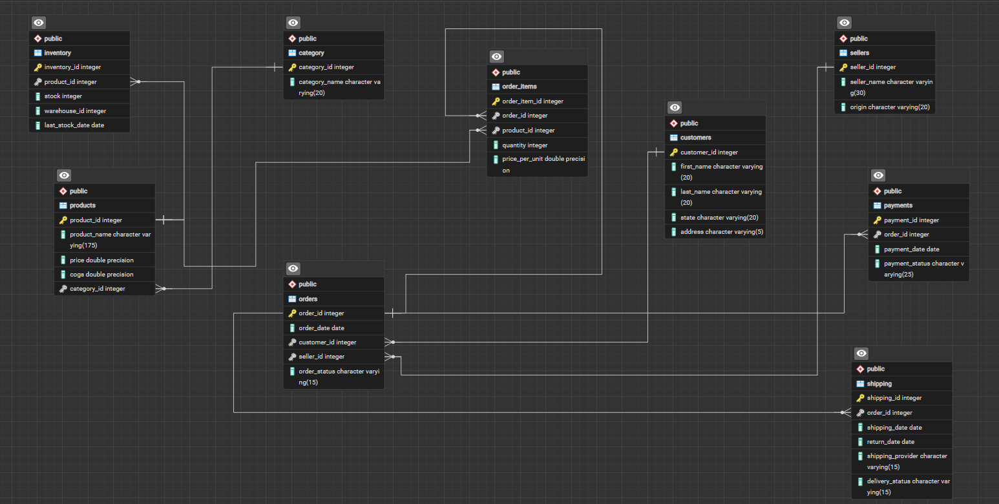

# Amazon E-commerce Sales & Operations Analytics Pipeline

An end-to-end e-commerce analytics project covering **SQL analysis, data
cleaning, Python/Pandas ETL, dimensional modeling, and Power BI**.

> **Current Status:** Part 1 completed --- SQL + ETL + Power BI-ready
> data.\
> **Part 2:** Power BI dashboard development.

------------------------------------------------------------------------

## Project Overview

This project analyzes an Amazon-style e-commerce dataset containing **9
related tables**:

`categories` • `customers` • `products` • `sellers` • `orders` •
`order_items` • `payments` • `shipping` • `inventory`

The project follows this pipeline:

``` text
Raw CSV Data
     ↓
PostgreSQL Database
     ↓
Relationships + EDA + Data Cleaning
     ↓
SQL Business Analysis
     ↓
Python + Pandas ETL
     ↓
Fact & Dimension Tables
     ↓
Power BI-ready CSVs
     ↓
Power BI Dashboard (Part 2)
```

------------------------------------------------------------------------

## Tech Stack

## Tech Stack

| Technology | Purpose |
|---|---|
| **PostgreSQL / SQL** | Database creation, EDA, data cleaning and business analysis |
| **Python** | ETL and data transformation |
| **Pandas** | Data cleaning, merging, date handling and dimensional modeling |
| **SQLite** | Lightweight database used in the Python ingestion workflow |
| **SQLAlchemy** | Python-to-database connectivity |
| **Power BI** | Final visualization and BI dashboard — Part 2 |
  -----------------------------------------------------------------------

## 1. Database Design & EDA

The original dataset was structured into **9 relational tables**, with
primary-key/foreign-key relationships created between the tables.

The SQL stage included:

-   Database and table creation
-   Relationship/foreign-key validation
-   Null and duplicate checks
-   Date-range validation
-   Text cleaning using `TRIM()`
-   Missing-value handling
-   Status-value validation
-   Product price/COST checks
-   Cross-table consistency checks
-   Referential-integrity validation

The database schema ER Diagram is documented below:



------------------------------------------------------------------------

## 2. SQL Business Analysis

I answered the following **20 business questions** using SQL techniques
such as **multi-table joins, aggregations, `GROUP BY`, `HAVING`, `CASE`,
CTEs, subqueries, window functions, ranking, date calculations and
conditional aggregation**.

### Sales & Product Analysis

1.  **Top 10 selling products** based on non-cancelled/non-returned
    orders, including category, orders, quantity sold and sales value.
2.  **Revenue by product category**, including each category's sales
    contribution.
3.  **Average Order Value (AOV)** for customers with at least 15 orders.
4.  **Month-by-month sales trend**, comparing current-month sales with
    the previous month.
5.  **Customers registered but with no orders.**
6.  **Top 3 best-selling categories in each state**, including sales
    value.
7.  **Least-selling category in each state**, including sales value.
8.  **Customer lifetime order value**, including total orders, total
    sales and customer ranking.
9.  **Low-stock products** below a threshold of 10 units, along with
    warehouse sales analysis.
10. **Orders with shipping delays of more than 5 days**, including
    customer, order and shipping details.

### Payments, Sellers & Profitability

11. **Payment-status contribution percentage** across all orders.
12. **Top 5 sellers by sales**, including successful/failed orders,
    success rate, and the top products of the highest-ranked seller.
13. **Gross profit and profit margin by product**, including product
    ranking.
14. **Top 10 most-returned products**, including returned quantity and
    return rate.
15. **Sellers with no sales in the last 6 months**, including their
    latest sale date and total sales.
16. **Customer return activity** for customers with at least 10 orders
    in the last 2 years, including return rate and return-frequency
    classification.
17. **Top 5 customers in each state** based on number of orders and
    their total sales.
18. **Running total sales by year**, along with yearly sales.

### Operations & Growth

19. **Shipping-provider performance**, including revenue, orders
    handled, average delivery time and order contribution.
20. **Year-over-Year revenue growth percentage** for each recorded year.

------------------------------------------------------------------------

## 3. Advanced SQL

The analysis demonstrates practical use of:

``` text
JOINs
GROUP BY / HAVING
Aggregate Functions
CASE Statements
CTEs
Subqueries
Window Functions
DENSE_RANK()
ROW_NUMBER()
LAG()
Conditional Aggregation
Date / Interval Calculations
Stored Procedures
```

### Stored Procedure

A PostgreSQL stored procedure named `add_sales` was implemented to
automate inventory updates when a new sale is added.

It:

1.  Checks the product and its price.
2.  Checks inventory availability.
3.  Inserts the new order.
4.  Inserts the order item.
5.  Calculates total sales.
6.  Decreases inventory stock.
7.  Displays a status message when the product is unavailable.

------------------------------------------------------------------------

## 4. Python ETL & Dimensional Modeling

After the SQL analysis, Python/Pandas was used to create an
analytics-ready model.

### ETL Script

``` text
python script/
├── fact_dim_creation.py
```

### Final Analytical Model

``` text
                 DimCustomer
                      │
DimDate ──────── FactSales ──────── DimProduct
                      │
                  DimSeller


                 DimProduct
                     │
DimDate ─────── FactInventory ───── DimWarehouse
```

### Generated Tables

```text
data/
└── powerbi datasets/
    ├── dim_customers.csv
    ├── dim_date.csv
    ├── dim_products.csv
    ├── dim_sellers.csv
    ├── dim_warehouse.csv
    ├── fact_inventory.csv
    └── fact_sales.csv

The date dimension uses a continuous date range and supports time-based
analysis in Power BI.
```
------------------------------------------------------------------------

## 5. Repository Structure

``` text
Amazon-E-commerce-Sales-Operations-Analytics-Pipeline/
│
├── data/
│   ├── original datasets/
│   │   ├── categories.csv
│   │   ├── customers.csv
│   │   ├── inventory.csv
│   │   ├── order_items.csv
│   │   ├── orders.csv
│   │   ├── payments.csv
│   │   ├── products.csv
│   │   ├── sellers.csv
│   │   └── shipping.csv
│   │
│   └── powerbi datasets/
│       ├── dim_customers.csv
│       ├── dim_date.csv
│       ├── dim_products.csv
│       ├── dim_sellers.csv
│       ├── dim_warehouse.csv
│       ├── fact_inventory.csv
│       └── fact_sales.csv
│
├── python script/
│   ├── fact_dim_creation.py
│   └── requirements.txt
│
├── schemas/
│   ├── powerbi data model.png
│   └── sql_database_schema.png
│
├── sql analysis/
│   ├── 01 database creation.sql
│   ├── 02 EDA & Cleaning.sql
│   └── 03 business questions.sql
│
└── README.md
```

------------------------------------------------------------------------

## 6. Complete Pipeline / How to Update the Project

The project follows a **full-refresh workflow**.

Whenever the source database/data is changed:

### Step 1 --- Rebuild the analytical model

Run:

``` text
fact_dim_creation.py
```

This regenerates the fact and dimension tables and overwrites the Power
BI-ready CSV files with the latest data.

### Step 2 --- Refresh Power BI

Open the Power BI project and perform:

``` text
Refresh
```

Power BI then reads the updated CSV files and updates the dashboard and
insights.

### Complete Workflow

``` text
Change Source Data
       ↓
fact_dim_creation.py
       ↓
Updated Fact/Dimension Tables
       ↓
Power BI Refresh
       ↓
Updated Dashboard & Insights
```

This makes the project reproducible: **data changes → ETL → refreshed
analytical model → refreshed BI output.**

------------------------------------------------------------------------

# Part 2 --- Power BI Dashboard

Part 2 will use the generated fact and dimension tables to build the
final Business Intelligence layer.

Planned work:

-   Build the Power BI star-schema relationships
-   Create DAX measures and KPIs
-   Sales performance dashboard
-   Product/category analysis
-   Customer analysis
-   Seller analysis
-   Inventory and warehouse analysis
-   Shipping/operations analysis
-   Payment and return analysis
-   Time-series and YoY analysis
-   Slicers and interactive filtering
-   Final dashboard design

Power BI screenshots will be added to the repository in Part 2

------------------------------------------------------------------------

## Skills Demonstrated

**SQL • PostgreSQL • Python • Pandas • ETL • Data Cleaning • EDA •
Relational Database Design • Star Schema • Fact & Dimension Modeling •
Window Functions • CTEs • Subqueries • Stored Procedures • SQLAlchemy •
SQLite • Power BI**

------------------------------------------------------------------------

## Project Status

### Part 1 --- Data & Analytics Engineering

-   [x] Database design & relationships
-   [x] EDA & data cleaning
-   [x] 20 SQL business questions
-   [x] Advanced SQL analysis
-   [x] Stored procedure
-   [x] Python/Pandas ETL
-   [x] Fact & dimension modeling
-   [x] Power BI-ready datasets

### Part 2 --- Business Intelligence

-   [ ] Power BI data model
-   [ ] DAX measures
-   [ ] Dashboard development
-   [ ] Interactive analysis
-   [ ] Final insights & documentation

## Author

**Pranay Jha**

Data Analytics & Business Intelligence
